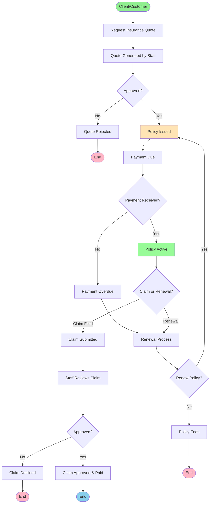

# RiskSecure System Flowchart

```mermaid
graph TD
    Start([Client/Customer]) --> Request[Request Insurance Quote]
    Request --> GetQuote[Quote Generated by Staff]
    GetQuote --> Decision1{Approved?}
    
    Decision1 -->|No| Reject[Quote Rejected]
    Reject --> End1([End])
    
    Decision1 -->|Yes| Policy[Policy Issued]
    Policy --> Payment[Payment Due]
    Payment --> PayStatus{Payment Received?}
    
    PayStatus -->|No| Overdue[Payment Overdue]
    Overdue --> Renewal
    
    PayStatus -->|Yes| Active[Policy Active]
    Active --> UsePolicy{Claim or Renewal?}
    
    UsePolicy -->|Claim Filed| Claim[Claim Submitted]
    Claim --> Review[Staff Reviews Claim]
    Review --> Decision2{Approved?}
    Decision2 -->|No| ClaimDeclined[Claim Declined]
    Decision2 -->|Yes| ClaimApproved[Claim Approved & Paid]
    ClaimDeclined --> End2([End])
    ClaimApproved --> End3([End])
    
    UsePolicy -->|Renewal| Renewal[Renewal Process]
    Renewal --> RenewalDecision{Renew Policy?}
    RenewalDecision -->|No| PolicyEnd[Policy Ends]
    PolicyEnd --> End4([End])
    RenewalDecision -->|Yes| Policy
    
    style Start fill:#90EE90
    style End1 fill:#FFB6C6
    style End2 fill:#FFB6C6
    style End3 fill:#87CEEB
    style End4 fill:#FFB6C6
    style Policy fill:#FFE4B5
    style Active fill:#98FB98
```
